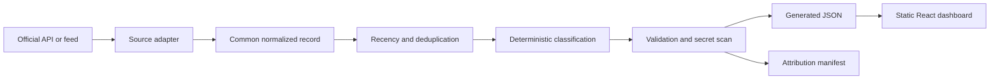
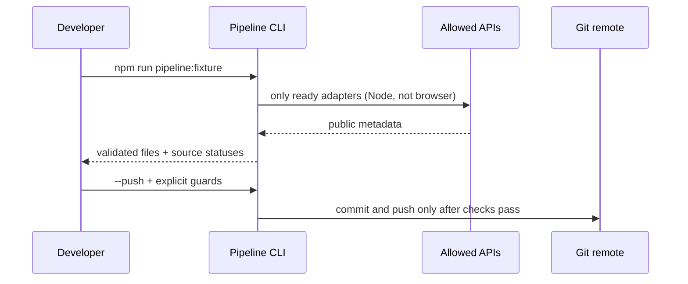

# Idea Atlas

Idea Atlas is a static React dashboard and a small, source-neutral idea
pipeline for a noncommercial developer gift. It turns public source metadata
into practical project prompts while preserving provenance, licence information,
attribution, and a seven-day recency window. The existing visual theme is kept
intact; the browser never fetches or scrapes source websites.

## Checkpoint 1–2 status

Implemented:

- shared normalized idea shape and deterministic classification for quality,
  category, difficulty, technology tags, and recommendation;
- adapter/config entries for Hacker News, GitHub, Data.gov, World Bank, NASA,
  OpenAlex, OpenStreetMap, Wikimedia, Reddit, DEV.to, Kaggle, Stack Overflow,
  and EU Open Data;
- active Node-side official API adapters for Hacker News, GitHub repositories,
  OpenAlex works, Data.gov, World Bank, NASA, Wikimedia Commons, DEV.to,
  Stack Overflow, and EU Open Data;
- generated JSON plus `attribution-manifest.json`;
- validation, deduplication, approval preservation, secret scanning, and focused
  tests;
- guarded pipeline execution with dry-run default and opt-in push safeguards.

Reddit, Kaggle, and OpenStreetMap remain disabled pending manual policy or
licence review. Active adapters are capped at 20 normalized records per source,
and a failed source is reported explicitly without preventing other adapters
from completing.

## Workflow





## Setup and commands

Requirements: Node.js 20+ and npm 10+.

```bash
npm install
npm run dev
```

Validation:

```bash
npm test
npm run test:python
npm run lint
npm run build
```

Pipeline commands:

```bash
npm run pipeline:fixture                 # deterministic, offline, dry-run
npm run pipeline                         # fetches only adapters marked ready
npm run pipeline -- --sources=hacker-news
npm run pipeline -- --sources=github,openalex
```

The fixture command is the recommended local and CI path. It writes:

- `src/data/generated/pipeline-ideas.json`
- `src/data/generated/attribution-manifest.json`

Generated records carry an `approved` field for later editorial review. The
dashboard displays validated kept records immediately so the collection can be
tested; discarded enrichment decisions remain audit metadata rather than public
ideas. The field remains available for a future reviewed-publication mode.

The live GitHub adapter uses the official repository search API and accepts an
optional `GITHUB_TOKEN` environment variable to raise the authenticated rate
limit. The token is read only by the Node pipeline, is never written to output,
and is not required for fixture mode. OpenAlex uses one official works request
per run with a bounded page size and no credential.
Data.gov, World Bank, NASA, Wikimedia Commons, DEV.to, Stack Overflow, and EU
Open Data use their official public APIs from Node only. NASA reads the
optional `NASA_API_KEY` environment variable and falls back to `DEMO_KEY`.
Data.gov uses its v4 search API and reads optional `DATAGOV_API_KEY`, falling
back to `DEMO_KEY`. No API key is exposed to the frontend or written to
generated output. Collection
uses a seven-day source window, while the generated dataset removes records
older than six weeks (42 days).

### YouChat decision enrichment

The deterministic collector remains offline-safe and does not call an LLM.
After collection, the enrichment stage passes each complete source record to
YouChat. YouChat must decide whether to discard the record or write a genuinely
specific project idea; it is not allowed to fill in generic boilerplate.

```bash
python -m pip install -r requirements-enrichment.txt
npm run enrich:fixture                 # offline, deterministic record-specific fallback
npm run enrich:youchat                 # explicit ai4free/YouChat decision request
npm run enrich:fixture:dry-run         # validate fallback, without writing
npm run enrich:youchat:dry-run         # request and validate, without writing
```

`enrich:youchat` is optional and fails clearly when `ai4free` is missing or its
transitive dependencies are incompatible. The package has had releases whose
declared dependencies do not fully match its provider imports, so install it
in a clean virtual environment and treat import errors as an upstream
compatibility problem rather than bypassing them:

```powershell
python -m venv .venv-enrichment
.venv-enrichment\Scripts\python.exe -m pip install -r requirements-enrichment.txt
.venv-enrichment\Scripts\python.exe scripts\enrich_with_youchat.py --enrich --dry-run
```

The script imports the documented `YouChat` provider class. If that import
fails, use the deterministic fixture mode until a compatible ai4free release
is available; do not commit package internals or browser cookies.
If the provider initializes but returns `401 Unauthorized`, You.com rejected
the unofficial request. The pipeline does not bypass authentication or copy
browser cookies; use `npm run enrich:fixture` or another permitted model/API.
It uses the Python [ai4free](https://github.com/Devs-Do-Code/ai4free) project
by Devs-Do-Code to access You.com/YouChat. This is an unofficial,
reverse-engineered provider integration: review its terms and service
availability before use. It is a developer-side generation step, never a
browser-runtime dependency, and requires no service credentials or cookies.

The response is a strict JSON decision with exactly `decision`,
`discardReason`, `title`, `summary`, `category`, `difficulty`, `technologies`,
`datasetTools`, `whyBuildIt`, and `suggestedSteps`. A `discard` response keeps
the complete record and its reason in the generated audit payload, while the
React data loader excludes it from public ideas. A `keep` response supplies all
copy fields, including tailored steps. Source IDs, URLs, licences, attribution,
dates, approval, and other provenance are protected. Malformed output is
reported per item; provider failures preserve the original record instead of
turning it into an editorial discard. The destination is written through an
atomic replacement so a failed run cannot corrupt the input. The deterministic
fallback is record-specific, derives categories such as IT, Programming,
Computer Science, Data Science, and IoT from source content, and is suitable
for tests, builds, and offline previews.

### Optional Gemini decision enrichment

Gemini is an alternative developer-run enrichment provider using Google's
official `google-genai` Python package. It is never imported by Vite, the
browser, or the normal collection pipeline, and it is not required to build
the dashboard.

```powershell
python -m pip install -r requirements-gemini.txt
npm run enrich:gemini -- --dry-run
npm run enrich:gemini
```

The command reads `GEMINI_API_KEY` and `GEMINI_MODEL` from the process
environment first, then `.env.local`; `.env.example` documents the names
without containing a key. `GEMINI_MODEL` defaults to
`gemini-3.5-flash-lite`. The key is never logged, placed in prompts, or written
to generated JSON. Each response must satisfy the same strict keep/discard
schema used by YouChat. Malformed or failed records preserve the complete
source/provenance record and remain retryable; other records continue. HTTP
429/resource-exhausted responses retry with bounded
exponential backoff. Gemini usage is optional and subject to Google API
quotas, model availability, billing, and current terms; use dry-run first and
review generated copy before publication.
Gemini processes five records per source site request by default; change this
with `--batch-size`. The dashboard displays only records with
`decision: "keep"` and `enrichedBy: "gemini"`, so failed or not-yet-enriched
records stay hidden until a successful retry.

### Guarded automatic push

Push is never the default. A push requires all of the following:

```bash
$env:ALLOW_AUTO_PUSH = "true"
$env:PUSH_BRANCH = "main"
npm run pipeline -- --push --fixture
```

- `--push` is explicit and `ALLOW_AUTO_PUSH=true` is also required.
- `PUSH_BRANCH` must exactly match the checked-out branch.
- the working tree must be clean before collection;
- the pipeline runs the test suite before writing or committing;
- generated JSON and the manifest are scanned for common token formats;
- only the two generated files are staged;
- the script creates a commit with the Copilot co-author trailer and pushes to
  `origin` on the confirmed branch.

Do not use automatic push when reviewing generated records. Inspect the diff,
licence notes, and approval flags first.

## Source and licence matrix

| Source | Access in this checkpoint | Licence / attribution handling |
| --- | --- | --- |
| Hacker News | Ready: public Firebase API | Attribute Hacker News / Y Combinator; linked content remains with authors |
| GitHub | Ready: REST API | Repository-specific licence and GitHub API terms |
| Data.gov | Ready: catalog API | Verify the publishing agency's dataset licence |
| World Bank | Ready: Open Data API | World Bank Open Data terms |
| NASA | Ready: NASA API | NASA guidance and item-specific restrictions |
| OpenAlex | Ready: works API | OpenAlex terms; cite works, never copy full text |
| OpenStreetMap | Manual licence review | ODbL, © OpenStreetMap contributors, share-alike obligations |
| Wikimedia | Ready: MediaWiki API | Preserve each item's licence and creator attribution |
| Reddit | Manual policy review | OAuth and current API/reuse policy required |
| DEV.to | Ready: articles API | Attribute the author; metadata and links only |
| Kaggle | Manual licence review | Dataset-specific licence and authenticated API terms |
| Stack Overflow | Ready: Stack Exchange API | CC BY-SA contributions and API terms |
| EU Open Data | Ready: portal API | Dataset-specific European data licence |

“Ready” means the Node adapter uses the documented official endpoint; it does
not waive item-level licence review. No browser automation, HTML scraping, or
credential committed to the repository is permitted.

## Data model and attribution

The shared model in `src/types.ts` keeps UI fields and provenance together:

- stable `id`, title, summary, category, difficulty, technologies;
- `sourceId`, `sourceName`, canonical `sourceUrl`;
- `license`, `usageNote`, `attribution`, `collectedAt`, and optional
  `publishedAt`;
- deterministic `qualityScore` (0–100), `recommendation` (`build`,
  `consider`, or `research`), an explicit `approved` flag, and an optional
  enrichment `decision`/`discardReason` audit marker.

`scripts/sourceCatalog.ts` is the policy boundary. `scripts/sourceAdapters.ts`
registers every selected source and makes skipped/manual-review states visible.
`scripts/deterministicClassification.ts` uses stable keyword and metadata rules;
there are no LLM calls in the normal pipeline. The Python enrichment stage
passes the full collected record to YouChat and never changes provenance.

## Limitations and review checklist

- Current collection produces live records for all sources marked Ready in the
  source matrix; manual-review sources remain placeholders with documented
  restrictions.
- GitHub records without item-level licence metadata are skipped rather than
  presented as reusable source material.
- Public API availability does not grant permission to republish content.
  Verify item-level licences before changing `approved` to `true`.
- collection accepts only records from the previous seven days;
- generated output is rebuilt each weekly run, so records older than six weeks
  are removed rather than carried forward;
- missing/invalid dates are rejected.
- Rate limits, API policy changes, and endpoint availability can change.
- No screenshots are included in this documentation because no real capture was
  supplied; do not replace this with a fabricated image.
- Generated summaries are short metadata summaries, not source content or legal
  advice. Optional enrichment is generated copy and should be reviewed before
  publication.

Before publishing a new source-backed record:

1. confirm the official API/feed and current terms;
2. keep the canonical source URL and item-level licence;
3. check the seven-day collection window and deduplication result;
4. inspect the generated diff and attribution manifest;
5. set `approved: true` only after human review.

## Repository map

- `src/App.tsx`, `src/styles.css`: static dashboard UI; no runtime data fetch.
- `src/types.ts`: shared normalized/UI types.
- `scripts/sourceCatalog.ts`: selected sources and policy metadata.
- `scripts/sourceAdapters.ts`: source-neutral adapter registry.
- `scripts/hackerNewsPipeline.ts`, `scripts/githubPipeline.ts`,
  `scripts/openAlexPipeline.ts`, `scripts/safePublicApiPipelines.ts`: official
  API adapters, normalization, recency filtering, deduplication, and
  validation.
- `scripts/run-pipeline.ts`: orchestration, generation, safety guards, and
  optional push.
- `scripts/*.test.ts`: focused deterministic pipeline tests.
- `src/data/generated/`: generated payloads and attribution manifest.
- `.github/copilot-instructions.md`: contributor and agent guardrails.

The repository is GPL-3.0 licensed (see `LICENSE`). External sources retain
their own rights and terms. The application uses React, Vite, TypeScript,
Vitest, and Lucide React under their respective open-source licences; see
`package.json` and installed package notices for the complete dependency list.
